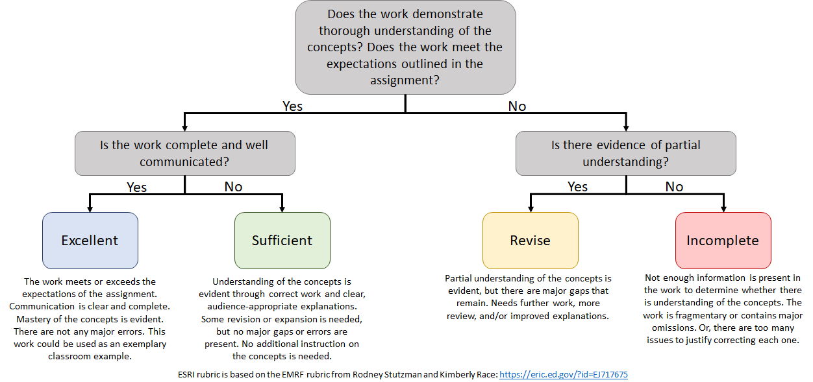

Project 7
================

Remember that Projects do not have fixed deadlines. You can work on this
item until you are ready to submit it. However, remember the [**two
items per
week**](https://sta518.github.io/courses/course-grading/revision/#projects)
policy.

## Overview

In this Project, you will create tidy data about yourself\! That is, you
will build a résumé or personal website in R/RStudio. If you run into
any issues we should be able to get them workout out.

Learning Targets associated with this Project:

  - **EE.2** - I can explore new functions or packages and implement
    them into analysis.
  - **PD.1** - I can use a project-based workflow to organize analysis
    documents.

Your final report should interweave code, output, and narrative. All
work should be done within your `project07.Rmd` file and your final
report will be the resulting knitted `project07.md` file.

You will submit a link to your finalized `project07-<username>` repo
through Bb. This done at the same place where you created this repo.

## Getting Help

You are allowed to use books or searching online resources like
Google/Bing or StackOverflow to find suggestions during this Project,
but **you must cite any resource** that you use beyond the R4DS textbook
and class activities (that is, you do not need to site R4DS or the class
activities). You may not communicate with any person other than your
instructor. Violations of this policy include *any* consultation with
other students or former students, including Stat Tutoring Center
tutors; using work from another student or former student; submitting
the problem to a online help site like StackOverflow, Chegg, Coursehero,
or any online forum. All such violations will be treated as academic
dishonesty and will *minimally* result in a grade of **I** and being
banned from revising the work.

If your instructor feels that a question you ask would benefit the
entire class (e.g, it will clarify a general item), you will be
redirected to post that as an Issue in the community repo. **You may
only post questions about this project on the community repo if
instructed to do so.** You may not share information with other people
about the content of this Project unless explicitly approved by your
instructor.

## Evaluation

Projects are graded using the
[“*ESRI*”](https://sta518.github.io/courses/course-grading/grading/#projects)
marking system.

A grade of **E** or **S** requires all of the following to be met:

  - You committed/pushed everything in your repository including your
    `project07.md` file. Repos that do not contain a `project07.md` file
    will be automatically graded **I**.
  - For Tasks 3 & 4, you use efficient coding practices and follow the
    coding style guide that we have been using in the activities to
    produce the desired output.
  - All discussion or descriptions are clear and completely discuss
    important details. Your discussions or descriptions should be
    written for someone with a STA 215 (Introductory Statistics)
    background, but they do not have any experience with R.
  - There are no errors in your code.

A grade of **E** is given if all the stated expectations are met and the
work is of superior quality in terms of the clarity of explanations and
work, appearance of the report, and precision of code.

Correct computation with insufficient explanation will need to be
revised (**R**) and may receive an **I** grade.

## ☑️ Task 1: Git-ing Started

These steps are slightly different than previous Git-ing Started
directions because you will be working by yourself. You are still
welcome to create branches to help you organize your work, but this is
not an expectation.

1.  In the root of this GitHub repository (i.e.,
    `STA518-<section>-Fall20/project07-<username>`), click on the “Code”
    button.

<!-- end list -->

  - Verify that the drop-down says **Clone with HTTPS** (this is
    *probably* the default view; otherwise, select “Use HTTPS”)
  - Click on the clipboard-icon to copy the repo URL

<!-- end list -->

2.  Create a new Project. You can do this by clicking on the
    new-project-icon  or through the
    menus (File \> New Project…).

<!-- end list -->

  - In the *New Project Wizard* pop-up, select **Version Control** on
    the *Create Project* screen, then select **Git** on the *Create
    Project from Version Control* screen.
  - On the *Clone Git Repository* screen, paste the URL of your GitHub
    repository from (1) into the *Repository URL* dialog box. It should
    look like:
    `https://github.com/STA518-<section>-Fall20/activity0401-joins-part1-<teamname>.git`
  - The *Parent directory name* dialog box will be automatically
    populated with your repository name. It should look like:
    `activity0401-joins-part1-<teamname>`
  - In the *Create project as subdirectory of* dialog box, click on
    **Browse**.
  - In the *Choose Directory* pop-up, **Browse** to the class-level
    folder you created in Activity 1.2 (and possibly the `activities`
    folder) and click **Choose**.
  - Verify that the *Create project as a directory of* dialog box
    contains the folder location that you previously specified, then
    click on **Create Project**. You should then be asked to login with
    your GitHub credentials on a *Clone Repository* pop-up window - **do
    this**. **This *should* be the last time you need to provide your
    GitHub credentials.**

<!-- end list -->

3.  After a few seconds, your RStudio session will refresh and you
    should be in your newly created RStudio Project\! Remember that this
    is YOUR workspace and your Team Members will ONLY see what you have
    done once you commit/push to GitHub.
4.  In the **Git** pane (upper-right-hand pane of your RStudio session,
    the tab three to the right of **Environment**), click on
    new-branch-icon  (on the
    right-hand side of this pane’s tool bar).

<!-- end list -->

  - In the *New Branch* pop-up, name the branch your GitHub `username`
    and click **Create**. I hope that you are not prompted to provide
    your log-in with your GitHub credentials. 🤞

## ☑️ Task 2: Pick at least one

There are a number of packages that can aid in producing a résumé,
conference poster, or personal website in R/RStudio.

### Résumés

For résumés, I prefer the
[`vitae`](https://github.com/mitchelloharawild/vitae) package as it has
a number of pre-built templates and is fairly straightforward to [create
your own
template](https://pkg.mitchelloharawild.com/vitae/articles/extending.html).

In addition to the `vitae` package, the
[`pagedown`](https://github.com/rstudio/pagedown) package is another
option, that can also handle posters, articles, business cards, and
more\! The [Other
examples](https://github.com/rstudio/pagedown#other-examples) section
provides some links to users that have created different documents using
`pagedown`.

The author of vitae also provided a brief tutorial here:
<https://ropensci.org/blog/2019/01/10/vitae/>. Also, check out the
[Examples of using
vitae](https://github.com/mitchelloharawild/vitae#examples-of-using-vitae)
linked on the `vitae` repo.

### Personal website

For building a personal website, I feel like there is no competition -
use [`blogdown`](https://github.com/rstudio/blogdown) by Yihui Xie and
others at RStudio. However, there are two very interesting experimental
packages that I have not explored in great detail:

  - [`slumdown`](https://djnavarro.github.io/hugo-slum/) by Danielle
    Navarro, and
  - [`hugodown`](https://hugodown.r-lib.org/) by Hadley and others at
    RStudio,

Pick a [Hugo theme](https://themes.gohugo.io/). Once you decide on a
theme you like, you will need to have the GitHub username and repo for
that theme. After you get things set-up, its just adding content (pages
or posts).

[Yihui Xie](https://yihui.org/), [Amber
Thomas](https://amber.rbind.io/), and [Alison
Hill](https://alison.rbind.io/) have provided a free book to help with
creating a website: [blogdown: Creating Websites with R
Markdown](https://bookdown.org/yihui/blogdown/). This goes into great
detail of the process, but there are a number of great tutorials that
simplify this process. For example,

  - To create a GitHub page (e.g., “yourusername.github.io”), see this
    post by Nikhil Kaza:
    <https://sia.planning.unc.edu/post/using-blogdown/>
  - To create a Netlify page, see Martin Frigaard’s post:
    <http://www.storybench.org/how-to-build-a-website-with-blogdown-in-r/>

Hasse Walum and Desiree De Leon created this intro to R and Statistics
online textbook using **blogdown**, **learnr**, and **shiny**:
<https://tinystats.github.io/>

There are a number of different GitHub themes. Some examples include:

  - [architect](https://pages-themes.github.io/architect)
  - [cayman](https://pages-themes.github.io/cayman)
  - [dinky](https://pages-themes.github.io/dinky)
  - [hacker](https://pages-themes.github.io/hacker)
  - [leap-day](https://pages-themes.github.io/leap-day)
  - [merlot](https://pages-themes.github.io/merlot)
  - [midnight](https://pages-themes.github.io/midnight)
  - [minimal](https://pages-themes.github.io/minimal)
  - [modernist](https://pages-themes.github.io/modernist)
  - [slate](https://pages-themes.github.io/slate)
  - [tactile](https://pages-themes.github.io/tactile)
  - [time machine](https://pages-themes.github.io/time%20machine)

## ☑️ Task 3: Submit your Project 7

Back at your Project 7 repo, copy the address to your final product
(i.e., either your résumé file or your personal site).

Go to the Project 7 assignment on [Bb](https://mybb.gvsu.edu). Paste
your repo’s link in the submission box as a *clickable* link and I will
have it assessed shortly.
